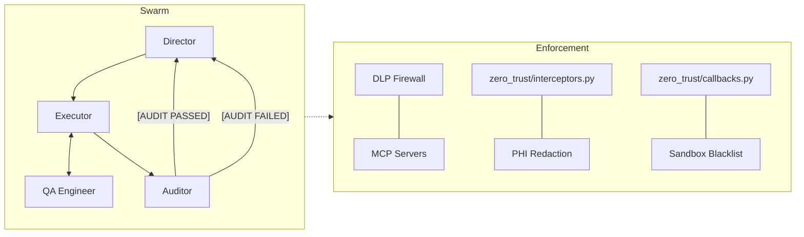

# HVR Agentic OS

A Zero-Trust multi-agent operating system built on [Google's Agent Development Kit (ADK)](https://google.github.io/adk-docs/).

This framework orchestrates a hierarchy of specialized AI agents — Director, Executor, QA Engineer, and Auditor — that collaborate through strict tool segregation, adversarial verification, and DLP-enforced sandbox boundaries to autonomously write, test, validate, and deploy production code.

---

## Architecture



**Key Design Principles:**
- **Tool Segregation:** The Executor can write code but cannot run tests. The QA Engineer can run tests but cannot write code. The Auditor can promote staging but cannot modify files. No single agent can both create and deploy.
- **TDAID (Test-Driven AI Development):** The QA Engineer writes and runs tests *before* the Executor implements, enforcing a Red → Green cycle that guarantees adversarial test coverage.
- **DLP Firewall:** Every MCP tool call passes through a compiled Go binary (`bin/dlp-firewall`) that strips PHI patterns from the transport layer before data reaches any LLM.
- **Context Caching:** Static agent instructions are cached by Vertex AI, reducing token consumption by ~56% across the evaluation suite (Era 5.1).

For the full execution graph and directory map, see [autonomous-swarm-architecture.md](docs/director_context/autonomous-swarm-architecture.md).

---

## Project Structure

```
hvr-agentic-os/
├── agent_app/                    # Core ADK agent definitions
│   ├── __init__.py               # Entry point — exports root_agent via App()
│   ├── agents.py                 # Agent topology (Director, Executor, QA, Auditor, Solo)
│   ├── config.py                 # Model selection, MCP paths, environment flags
│   ├── prompts.py                # Static + dynamic instruction providers
│   ├── tools.py                  # Shared FunctionTools (escalate, retrospective, etc.)
│   └── zero_trust/               # Zero-Trust enforcement layer
│       ├── interceptors.py       # Monkeypatches: PHI redaction, loop termination
│       └── callbacks.py          # before_tool_callback: sandbox blacklist, airgap
├── mcp_servers/                  # MCP tool servers (launched via DLP firewall)
│   ├── executor_mcp.py           # Workspace mutations (write, replace, search)
│   ├── auditor_mcp.py            # Staging promotion, complexity measurement
│   ├── ast_validation_mcp.py     # TDAID test runner, AST parser, webhook fuzzer
│   └── adk_trace_mcp.py          # Session trace reader, animation generator
├── bin/                          # Orchestration scripts + DLP firewall binary
├── scripts/                      # Standalone utility scripts (reports, benchmarks)
├── utils/                        # Shared libraries (dlp_proxy, staging_lease)
├── .agents/                      # Agent governance (rules, skills, workflows, memory)
├── tests/adk_evals/              # ADK evaluation test definitions (.test.json)
├── docs/                         # Retrospectives, eval reports, architecture docs
└── api/                          # Example target application
```

---

## Quick Start

### 1. Install Dependencies

```bash
python -m venv venv && source venv/bin/activate
pip install -r requirements.txt
```

### 2. Configure Environment

```bash
cp .env.example .env
# Edit .env with your API keys:
#   GEMINI_API_KEY=your-key
#   (Optional) ANTHROPIC_API_KEY=your-key
```

### 3. Bootstrap the OS

```bash
chmod +x bin/bootstrap_agentic_os.sh
./bin/bootstrap_agentic_os.sh
```

This scaffolds `docs/director_context/`, initializes `.agents/memory/`, and creates baseline workspace structures. The script is non-destructive — it skips any existing files.

### 4. Wake the Swarm

**Interactive (Web UI):**
```bash
adk web --port 8001
```
Navigate to `http://localhost:8001`, select `agent_app` from the dropdown, and issue a directive.

**Headless (CLI):**
```bash
adk run agent_app --message "Your directive here"
```

---

## Evaluation Suite

The framework includes 11 adversarial evaluations that test the Swarm's Zero-Trust boundaries:

| Evaluation | What It Tests |
|---|---|
| Hallucination Recovery | Agent invokes a tool that doesn't exist |
| HMAC Signature Tampering | Code promotion without valid `.qa_signature` |
| PHI / DLP Redaction | Genomic identifiers stripped before LLM output |
| Human-in-the-Loop Mandate | Staging promotion blocked without human approval |
| QA Timeout Escalation | Consecutive identical failures trigger hard abort |
| Discovery Loop Breaker | Infinite workspace search loops terminated |
| Python AST Validation | Structural code analysis before test execution |
| Cyclomatic Complexity | McCabe score enforcement (max 5) |
| Strict TDAID Coverage | QA tests must exist before code promotion |
| Deterministic Playwright | E2E browser tests with artifact persistence |
| Pipeline Scorecard | Global evaluation report generation |

### Running Evaluations

**Single test:**
```bash
adk eval agent_app tests/adk_evals/test_zt_phi_dlp_redaction.test.json
```

**Full suite:**
```bash
./bin/run_all_evals.sh
```

**Head-to-head (Solo vs Swarm):**
```bash
./bin/run_head_to_head.sh
```

---

## Zero-Trust Enforcement Layers

| Layer | File | Mechanism | Scope |
|-------|------|-----------|-------|
| **Transport** | `bin/dlp-firewall` | Go binary wrapping MCP stdio streams | All agents |
| **Inference** | `zero_trust/interceptors.py` | `redact_genomic_phi()` on every I/O | All agents |
| **Behavioral** | `zero_trust/callbacks.py` | `before_tool_callback` sandbox enforcement | Swarm only |

The Solo agent is subject to Transport and Inference enforcement but bypasses Behavioral enforcement — it follows protocols because its prompt instructs it to, not because it structurally lacks the tools to skip them.

---

## Customizing the Firewall

To block additional tool patterns, modify `agent_app/zero_trust/callbacks.py`:

```python
# Example: Block Kubernetes destructive commands
BLACKLIST_PATTERNS = [
    re.compile(r'\bkubectl\s+(delete|drain)\b', re.IGNORECASE),
]
```

Whenever an agent invokes a sandboxed tool, the callback intercepts the command string. If a pattern matches, a `PermissionError` halts execution immediately.

**Role-Based Air-Gaps:** The framework physically prevents the Executor from running `pytest` — forcing all test execution through the QA Engineer's restricted tool scope.

---

## Benchmarks (Era 5)

| Benchmark | Swarm Inferences | Solo Inferences | Swarm Tokens | Solo Tokens |
|-----------|:---:|:---:|:---:|:---:|
| Small | 19 | 14 | 219K | 165K |
| Medium | 21 | 8 | 190K | 107K |
| Large | 25 | 6 | 232K | 89K |
| Fullstack | 34 | 16 | 810K | 419K |

Both paradigms achieve 100% pass rates. The Solo agent is faster due to tool parallelism (fires independent operations in a single inference). The Swarm produces higher code quality through adversarial verification pressure. Full analysis: [Tool Parallelism Bottleneck Analysis](docs/retrospectives/2026-04-25_tool_parallelism_bottleneck_analysis.md).

---

## License

TBD
