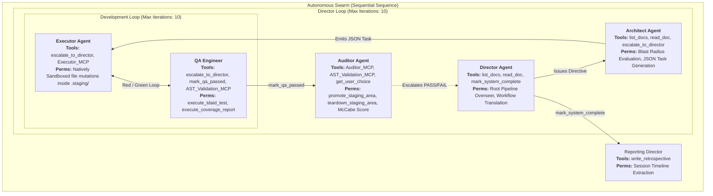

# Autonomous Swarm Architecture & Topography

This document maps the exact, flattened execution graph of the `autonomous_swarm` following the Zero-Trust Decapitation refactoring.

## Execution Graph

## Security Posture
- **Architect Decapitation:** The Architect physically lacks the `approve_staging_qa` tool and sits outside the backwards-facing evaluation stream. It cannot intercept payloads from QA.
- **QA Isolation:** The QA Engineer physically lacks deployment tools and cannot mutate code. It only controls the cryptographic `.qa_signature` loop gate.
- **Auditor Promotion Guard:** The Auditor operates securely outside the `Development Loop`, enforcing AST bounds natively on test-approved payloads before modifying the host system.
