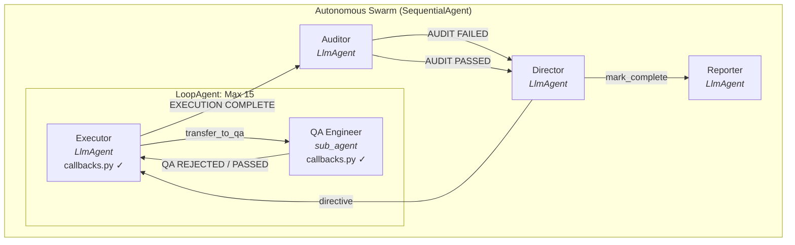
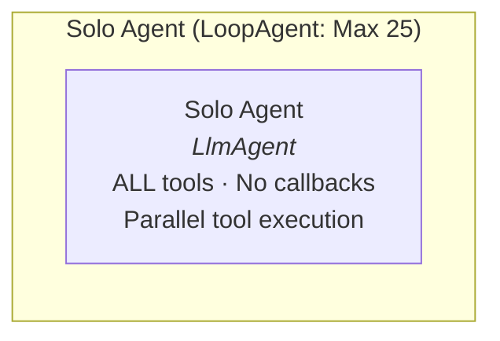
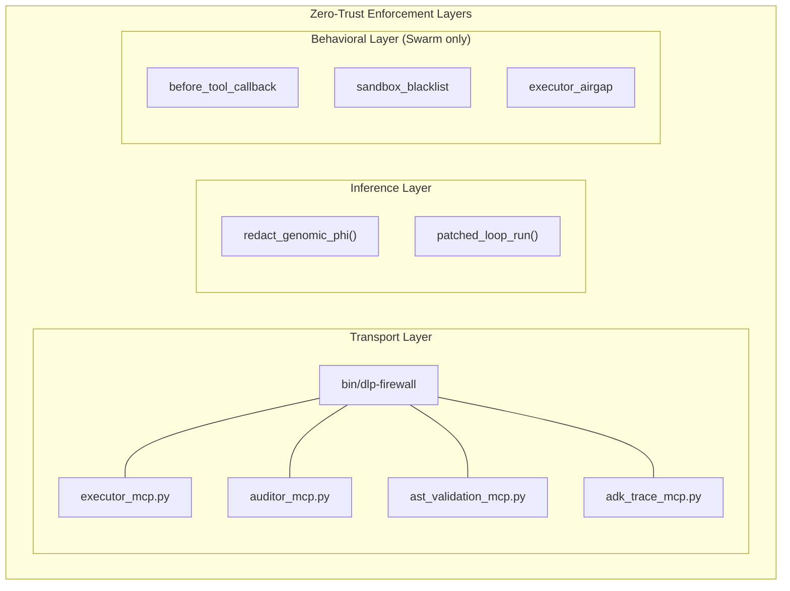

# Autonomous Swarm Architecture & Topography

This document maps the exact execution graph of the `autonomous_swarm` following the deployment of the **Iterative Macro-Loop** paradigm and the **Era 5 Public Release** structural refactor.

## Execution Graph








## Directory Structure

```
hvr-agentic-os/
├── agent_app/                    # Core ADK agent definitions
│   ├── __init__.py               # Entry point — exports root_agent via App()
│   ├── agents.py                 # Agent topology (Director, Executor, QA, Auditor, Solo)
│   ├── config.py                 # Model selection, MCP paths, environment flags
│   ├── prompts.py                # Static + dynamic instruction providers
│   ├── tools.py                  # Shared FunctionTools (escalate, retrospective, etc.)
│   ├── rag.py                    # Optional Vertex AI RAG corpus integration
│   └── zero_trust/               # Zero-Trust enforcement layer
│       ├── __init__.py            # Re-exports interceptors + callbacks
│       ├── interceptors.py        # Monkeypatches: LlmAgent PHI redaction, loop termination
│       └── callbacks.py           # before_tool_callback: sandbox blacklist, executor airgap
├── mcp_servers/                  # MCP tool servers (launched as subprocesses via DLP firewall)
│   ├── executor_mcp.py           # Workspace mutation tools (write, replace, search, list)
│   ├── auditor_mcp.py            # Staging promotion, teardown, complexity measurement
│   ├── ast_validation_mcp.py     # TDAID test runner, Nextflow AST parser, webhook fuzzer
│   ├── adk_trace_mcp.py          # Session trace reader, animation generator
│   └── diagnostics_mcp.py        # AWS Batch job diagnostics, CloudWatch log retrieval
├── bin/                          # Orchestration scripts
│   ├── dlp-firewall              # Compiled Go binary — MCP transport-layer PHI filter
│   ├── run_all_evals.sh          # Global evaluation suite runner
│   ├── run_head_to_head.sh       # Solo vs Swarm benchmark runner
│   └── run_kanban_benchmark.sh   # Fullstack Kanban benchmark runner
├── scripts/                      # Standalone utility scripts
│   ├── generate_global_eval_report.py
│   ├── generate_comparison_report.py
│   ├── inject_telemetry.py
│   └── plot_benchmarks.py
├── utils/                        # Shared library code
│   ├── dlp_proxy.py              # PHI redaction regex engine (inference layer)
│   └── staging_lease.py          # .staging/ mutex and lease management
├── .agents/                      # Agent governance layer
│   ├── rules/                    # Operational rules loaded into static_instruction
│   ├── skills/                   # Skill definitions (Playwright, Trivy, Trace Animator)
│   ├── workflows/                # Step-by-step workflow definitions
│   └── memory/                   # Ephemeral handoff ledger + media artifacts
├── tests/
│   ├── adk_evals/                # ADK eval test definitions (.test.json)
│   └── test_*.py                 # Pytest unit tests
├── docs/
│   ├── retrospectives/           # Canonical project retrospectives
│   ├── evals/                    # Evaluation reports and scorecards
│   ├── comparisons/              # Head-to-head artifact vaults
│   └── director_context/         # Architecture docs (this file)
└── api/                          # Example target application (bioinformatics endpoints)
```

## ADK Architecture Bindings

Our overarching Swarm topography is formally woven directly into execution constraints provided natively by the Google Agent Development Kit (ADK) framework:

- **`SequentialAgent` (The Spine)**: The primary execution pathway (`Director` → `Executor Loop` → `Auditor` → `Reporting Director`) is deployed cleanly as Python sequential boundaries, guaranteeing linear logical progression and trace isolation.
- **`LlmAgent` (The Nodes)**: The core nodes (`Director`, `Auditor`, `Reporter`) are strictly mapped as native intelligence pods bounded with specific, exclusive tool schemas.
- **`LoopAgent` (The Crucible)**: The `Executor Agent` is tightly sealed inside a distinct iteration configuration natively clamped to 15 max attempts, explicitly protecting the surrounding runtime from recursive token degradation loops.
- **`sub_agent` Delegation**: The `QA Engineer` is entirely decoupled from the central Python sequence. It operates flawlessly as a nested `sub_agent` bound to the Executor, trapping execution tracebacks localized to the testing sandbox until functional clearance resolves.

## Security Posture & Control Flows

- **The Architect Deprecation**: The legacy `Architect Agent` was structurally decommissioned. Removing the middleman explicitly prevented contextual degradation and JSON parsing bottlenecks, allowing the Director to cleanly orchestrate directives straight to the Executor.
- **The Red/Green Executor Loop**: Rather than relying on frail sequence routing, the `Executor Agent` is tightly bound within an ADK `LoopAgent`. The `QA Engineer` is mapped entirely as a specialized `sub_agent`. The Director's semantic directives trigger the Executor to immediately transfer control to the QA Engineer, who drafts the Red Baseline tests natively before the Executor attempts functional code mutations. The Executor iterates locally upon `[QA REJECTED]` and physically controls sequence propagation by explicitly yielding `[EXECUTION COMPLETE]` only after QA clears the test suite. 
- **Auditor In-Situ Override**: The Auditor operates securely outside the localized Development Loop, enforcing AST bounds and calculating McCabe Cyclomatic Complexity directly on test-approved payloads. If an anomaly is hit (e.g., Code Complexity > 5), the Auditor outputs `[AUDIT FAILED]` but is strictly blocked from executing a full `.staging/` teardown.
- **Director Macro-Loop**: The Director natively traps `[AUDIT FAILED]` signals emitted from the Auditor and spins them back out down the execution chain. This recursive bypass is known as **In-Situ Patching**, empowering the Executor to surgically refactor functional logic iteratively directly based on the Auditor's feedback without the destructive memory wipe of earlier Swarm paradigms.
- **Zero-Trust Hard Intercept:** The overarching swarm middleware (`agent_app/zero_trust/interceptors.py`) actively traps Paradox Escalations (like `escalate_to_director`). When unresolvable environment locks or logic loops are detected, the system natively aborts Swarm momentum and hard-escalates authority explicitly to the External Human Observer.

## Zero-Trust Enforcement Layers

The Zero-Trust architecture operates across three distinct enforcement layers:

| Layer | File | Mechanism | Scope |
|-------|------|-----------|-------|
| **Transport** | `bin/dlp-firewall` | Compiled Go binary wrapping all MCP server stdio streams | All agents (Solo + Swarm) |
| **Inference** | `zero_trust/interceptors.py` | `redact_genomic_phi()` on every LlmAgent input/output | All agents (Solo + Swarm) |
| **Behavioral** | `zero_trust/callbacks.py` | `before_tool_callback` sandbox blacklist + executor airgap | Swarm only (Executor + QA) |

The Solo agent is subject to Transport and Inference enforcement but bypasses Behavioral enforcement — it follows TDAID and staging protocols because its prompt instructs it to, not because it structurally lacks the tools to skip them.
