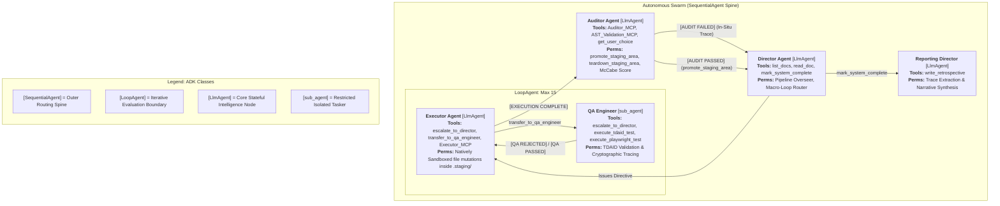

# Autonomous Swarm Architecture & Topography

This document maps the exact execution graph of the `autonomous_swarm` following the deployment of the **Iterative Macro-Loop** paradigm.

## Execution Graph

## ADK Architecture Bindings

Our overarching Swarm topography is formally woven directly into execution constraints provided natively by the Google Agent Development Kit (ADK) framework:

- **`SequentialAgent` (The Spine)**: The primary execution pathway (`Director` → `Executor Loop` → `Auditor` → `Reporting Director`) is deployed cleanly as Python sequential boundaries, guaranteeing linear logical progression and trace isolation.
- **`LlmAgent` (The Nodes)**: The core nodes (`Director`, `Auditor`, `Reporter`) are strictly mapped as native intelligence pods bounded with specific, exclusive tool schemas.
- **`LoopAgent` (The Crucible)**: The `Executor Agent` is tightly sealed inside a distinct iteration configuration natively clamped to 15 max attempts, explicitly protecting the surrounding runtime from recursive token degradation loops.
- **`sub_agent` Delegation**: The `QA Engineer` is entirely decoupled from the central Python sequence. It operates flawlessly as a nested `sub_agent` bound to the Executor, trapping execution tracebacks localized to the testing sandbox until functional clearance resolves.

## Security Posture & Control Flows

- **The Architect Deprecation**: The legacy `Architect Agent` was structurally decommissioned. Removing the middleman explicitly prevented contextual degradation and JSON parsing bottlenecks, allowing the Director to cleanly orchestrate directives straight to the Executor.
- **The Red/Green Executor Loop**: Rather than relying on frail sequence routing, the `Executor Agent` is tightly bound within an ADK `LoopAgent`. The `QA Engineer` is mapped entirely as a specialized `sub_agent`. The Executor iterates locally upon `[QA REJECTED]` and physically controls sequence propagation by explicitly yielding `[EXECUTION COMPLETE]` only after QA clears the test suite. 
- **Auditor In-Situ Override**: The Auditor operates securely outside the localized Development Loop, enforcing AST bounds and calculating McCabe Cyclomatic Complexity directly on test-approved payloads. If an anomaly is hit (e.g., Code Complexity > 5), the Auditor outputs `[AUDIT FAILED]` but is strictly blocked from executing a full `.staging/` teardown.
- **Director Macro-Loop**: The Director natively traps `[AUDIT FAILED]` signals emitted from the Auditor and spins them back out down the execution chain. This recursive bypass is known as **In-Situ Patching**, empowering the Executor to surgically refactor functional logic iteratively directly based on the Auditor's feedback without the destructive memory wipe of earlier Swarm paradigms.
- **Zero-Trust Hard Intercept:** The overarching swarm middleware actively traps Paradox Escalations (like `escalate_to_director`). When unresolvable environment locks or logic loops are detected, the system natively aborts Swarm momentum and hard-escalates authority explicitly to the External Human Observer.
