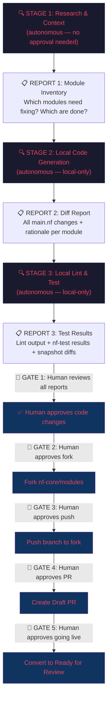

# Nextflow 2026 Hackathon — Swarm Implementation Plan

> **Target:** [nf-core Hackathon March 2026 — Project #146](https://github.com/orgs/nf-core/projects/146)
> **First Issue:** [`nf-core/modules#5409`](https://github.com/nf-core/modules/issues/5409) — Fix stub `touch .gz` patterns breaking nf-test snapshots

---

## Phases 1 & 2: ✅ Complete

- **739 items ingested** from Project #146 via paginated GraphQL
- **71 open/unassigned issues triaged** using weighted scoring matrix
- **Top candidate selected:** `modules#5409` (Score: 7.5)
- Data: [`hackathon_issues.json`](file:///Users/harrisonreed/Projects/ngs-variant-validator/scripts/hackathon/hackathon_issues.json)
- Script: [`ingest_hackathon_issues.py`](file:///Users/harrisonreed/Projects/ngs-variant-validator/scripts/hackathon/ingest_hackathon_issues.py)

---

## nf-core Contributing & Developing Conventions

> [!IMPORTANT]
> **This section is the ground truth for the swarm.** All conventions below are sourced directly from the official nf-core documentation at [`nf-core/website`](https://github.com/nf-core/website/tree/main/sites/docs/src/content/docs/contributing) and [`developing`](https://github.com/nf-core/website/tree/main/sites/docs/src/content/docs/developing). The swarm MUST NOT deviate from these rules.

### A. AI/LLM Usage Policy (nf-core Official)

nf-core's stance: **humans are ultimately responsible for submitted code, regardless of tools used.**

The swarm MUST:
1. **Keep PRs as small and focused as possible** — avoid scope creep
2. **Avoid any unnecessary changes** — no refactoring, code movement, or style changes beyond the fix
3. **Review all generated code before opening a PR** — the human (you) must verify
4. **Engage with the community review process** — expect revisions

Source: [how-to-contribute.md § Use of AI and LLMs](https://github.com/nf-core/website/blob/main/sites/docs/src/content/docs/contributing/how-to-contribute.md)

---

### B. Repository & Branching Conventions

| Rule | Detail |
|---|---|
| **Fork naming** | Name fork `nf-core-<repo>` (e.g., `HReed1/nf-core-modules`) |
| **Clone + upstream** | `git clone`, then `git remote add upstream https://github.com/nf-core/modules.git` |
| **Branch from** | `master` for `nf-core/modules` (not `dev`) |
| **Branch naming** | Use descriptive names: `fix-stub-gz-<tool>` or `<component-name>` |
| **Rebase before PR** | `git pull --rebase upstream master` |
| **PR target** | `master` for modules repo; `dev` for pipeline repos |
| **Commit messages** | Clear and descriptive: `"Fix stub touch .gz for <module-name>"` |

> [!WARNING]
> **Pipeline repos use `dev` as PR target. The modules repo uses `master`.** The swarm must verify the default branch of each target repo before creating PRs.

### C. Pre-commit Hooks

After cloning the fork:
```bash
pre-commit install
```
This sets up automatic code quality checks (Prettier formatting, etc.) that run on commit.

### D. nf-core-bot Commands

Available on `nf-core/modules` PRs:

| Command | Effect |
|---|---|
| `@nf-core-bot fix linting` | Auto-fix Prettier formatting issues |
| `@nf-core-bot update gpu snapshot path: $PATH` | Update GPU-based nf-test snapshots |

The swarm should comment `@nf-core-bot fix linting` on PRs after submission if CI reports formatting failures, rather than manually fixing Prettier.

---

### E. Module File Structure

Each nf-core module lives at `modules/nf-core/<tool>/` with this structure:

```
modules/nf-core/<tool>/
├── environment.yml       # Conda environment (used by container engines)
├── main.nf               # Process definition (script + stub blocks)
├── meta.yml              # Metadata: inputs, outputs, tool docs, bio.tools ID
└── tests/
    ├── main.nf.test      # nf-test test cases
    ├── main.nf.test.snap # Generated snapshot file (committed to repo)
    └── nextflow.config   # Optional test-specific config
```

### F. Module `main.nf` Conventions

1. **All optional parameters** go in `$args` (via `ext.args`), never hardcoded
2. **Version extraction** must use eval output qualifiers (topic channels) for new modules
3. **Bioconda version** must be the latest available
4. **Temporary files** must be cleaned up
5. **Large outputs** must use appropriate compression
6. **Stub blocks** — this is the critical section for our target issue:

#### Stub Block Rules

Stubs provide lightweight "fake" output for pipeline structure testing without running the actual tool. The key rule:

> **`touch filename.gz` creates an empty file that is NOT valid gzip.** This breaks nf-test snapshot assertions with `EOFException`. The fix is:
> ```bash
> echo '' | gzip > filename.gz
> ```

This applies to ALL compressed output formats (`.gz`, `.bgz`, `.bam`, `.cram`, etc.).

### G. `meta.yml` Requirements

- **All inputs and outputs** documented with descriptions
- **Correct `bio.tools` ID** for the tool
- **Correct EDAM ontology links**
- **Pattern specifications** for output files
- **Documentation links** to the tool's homepage/manual
- **Topic channel entries** (for modules migrated to topic channels):
  ```yaml
  topics:
    - versions:
        - - process:
              type: string
              description: The process the versions were collected from
          - tool:
              type: string
              description: The tool name
          - version:
              type: string
              description: The version of the tool
  ```

### H. Meta Map (`meta`) Convention

- nf-core modules use a `meta` map as the first element of input/output tuples
- The `meta` map carries sample-level metadata (e.g., `meta.id`, `meta.single_end`)
- Process outputs emit `[meta, file(s)]` tuples
- The meta map must be **propagated unchanged** through the module

### I. `ext.args` Convention

- Modules expose tool-specific options via `ext.args` (injected via `nextflow.config`)
- Permitted keys: `ext.args`, `ext.args2`, `ext.args3`, `ext.argsN`, `ext.prefix`, `ext.when`, `ext.use_gpu`
- The numeric order of args keys MUST match the order of tools in the script
- Pipeline-breaking parameters must be `input:` channels, not `ext.args`

---

### J. Testing with nf-test

#### Test Structure
```groovy
nextflow_process {
    name "Test <TOOL_NAME>"
    script "../main.nf"
    process "<TOOL_NAME>"

    test("test_name") {
        when {
            process {
                """
                input[0] = [...]
                """
            }
        }
        then {
            assertAll(
                { assert process.success },
                { assert snapshot(process.out).match() }
            )
        }
    }

    test("test_name - stub") {
        options "-stub"
        when {
            process {
                """
                input[0] = [...]
                """
            }
        }
        then {
            assertAll(
                { assert process.success },
                { assert snapshot(process.out).match() }
            )
        }
    }
}
```

#### nf-core Assertion Guidelines

1. **Always use `assertAll()`** to group assertions
2. **Minimum requirement:** Check `process.success` and snapshot `versions`
3. **Capture as much as possible:** Prefer `snapshot(process.out).match()` for full output
4. **Handle inconsistent MD5 sums:** Use `readLines()`, `contains()`, or file existence checks
5. **Snapshot specific elements:** `snapshot(process.out.versions).match("versions")`
6. **File existence check:** `assert file(process.out.output[0][1]).exists()`
7. **File content check:** `assert path(process.out.file[0][1]).readLines().any { it.contains("expected_string") }`

#### Test Data
- Use minimal test data from `tests/config/test_data.config` when possible
- Keep test datasets small and fast
- For large datasets, use stub tests

#### Running Tests
```bash
# Lint the module
nf-core modules lint <module-name>

# Run tests
nf-core modules test <module-name>

# Update snapshots after fixing stubs
nf-core modules test <module-name> --update
```

---

### K. PR Submission Protocol

1. **Create an issue** (or self-assign existing one) before starting work
2. **Fork → Clone → Branch → Code → Test → Commit**
3. **Rebase with upstream** before pushing:
   ```bash
   git pull --rebase upstream master
   git push origin <branch-name>
   ```
4. **Create PR** using the repository's template:
   - Reference the issue
   - Describe what changed and why
   - Explain testing approach
   - Include example commands if helpful
5. **Add label:** "Ready for Review"
6. **Request reviews** from `nf-core/modules-team`
7. **Post-submission:** If CI fails on formatting, comment `@nf-core-bot fix linting`

### L. Component Review Checklist (What Reviewers Check)

The swarm must ensure our PRs pass this checklist:

**General:**
- [ ] Adheres to nf-core module specifications
- [ ] All CI checks pass (linting, conda, singularity, docker)
- [ ] Runs offline — no automatic database downloads
- [ ] Code uses meta map correctly
- [ ] Code formatting is correct (indenting, spacing)

**`main.nf`:**
- [ ] All optional parameters in `$args` section
- [ ] Software version extraction optimized
- [ ] Bioconda version is latest
- [ ] Temporary files cleaned up
- [ ] Large outputs use correct compression

**Tests + `meta.yml`:**
- [ ] Tests exist for ALL outputs (including optional)
- [ ] `meta.yml` has correct documentation links and file patterns
- [ ] `meta.yml` has correct `bio.tools` ID and EDAM ontology links
- [ ] nf-test runs successfully and captures all outputs

---

## Phase 3: Implementation Plan for `modules#5409`

### 3.1 Issue Summary

**Problem:** Modules use `touch filename.gz` in stub blocks, creating empty files that aren't valid gzip. This breaks nf-test snapshot assertions with `EOFException`.

**Fix pattern:**
```diff
- touch ${prefix}.sorted.bam
+ echo '' | gzip > ${prefix}.sorted.bam
```

For specifically BAM/CRAM files:
```diff
- touch ${prefix}.bam
+ echo '' | gzip > ${prefix}.bam
```

**Scope:** ~19 modules remaining (per issue checklist as of March 2026)

### 3.2 Execution Steps Per Module

For each affected module:

1. **Read `main.nf`** — locate the `stub:` block
2. **Identify all `touch *.gz` / `touch *.bam` / `touch *.bgz` lines**
3. **Replace with `echo '' | gzip > filename`** — preserving the exact filename/variable
4. **Check for conditional stub logic** — some modules conditionally touch files (e.g., when `compress` flag is true). These need AST-level care, not blind sed
5. **Run `nf-core modules lint <module>`** — verify no new lint violations
6. **Run `nf-core modules test <module> --update`** — regenerate snapshots
7. **Verify snapshot diff** — ensure the new snapshots are valid (non-empty gzip MD5s)
8. **Commit** with message: `fix(modules): replace touch .gz with valid gzip in <module> stub`

### 3.3 PR Strategy Options

> [!IMPORTANT]
> **Decision needed:** Single batch PR for all ~19 modules, or individual PRs per module?
>
> **nf-core best practice (per AI policy):** "Keep PRs as small and focused as possible."
>
> **Recommendation:** Submit as **one PR** since this is a single atomic bug fix applied uniformly, and the issue's last commenter attempted the same batch approach. But individual per-module PRs are also acceptable and may get faster reviews.

### 3.4 Files to Modify

For each affected module:
- `modules/nf-core/<tool>/main.nf` — fix stub block
- `modules/nf-core/<tool>/tests/main.nf.test.snap` — regenerated by `nf-core modules test --update`

### 3.5 Context Gathering Protocol

Before executing, the swarm MUST:

1. **Read the issue comments** — `issue_read` → `get_comments` on `nf-core/modules#5409`
2. **Read the issue body checklist** — identify which modules are already fixed vs. remaining
3. **Read 2-3 merged PRs** that fixed other modules in this issue for the exact pattern
4. **Read `CONTRIBUTING.md`** in `nf-core/modules`
5. **Read `.github/PULL_REQUEST_TEMPLATE.md`** for required PR fields
6. **Verify default branch** — confirm `master` (not `dev`) is the PR target for modules

---

## Phase 4: Execution Protocol — Human-in-the-Loop Architecture

> [!CAUTION]
> **Per GEMINI.md guardrails, the following actions are STRICTLY FORBIDDEN without explicit, per-action human approval:**
> 1. Forking any repository
> 2. Creating Pull Requests against any external repository
> 3. Pushing commits to any remote
> 4. Creating branches on remote repositories
> 5. Merging or closing Pull Requests
> 6. Deleting remote branches or repositories
>
> **Approval of this implementation plan does NOT constitute approval for these actions.** The swarm must STOP at each gate below and wait for explicit human sign-off.

### 4.1 Gated Execution Flow



---

### 4.2 Stage 1: Research & Context (Autonomous)

**No approval needed.** The swarm reads publicly available information.

| Step | Action | Tool |
|---|---|---|
| 1.1 | Read issue `#5409` body + all comments | `issue_read` → `get_comments` |
| 1.2 | Parse the issue checklist to identify fixed vs. remaining modules | Local parsing |
| 1.3 | Read 2–3 merged PRs for exact fix patterns | `pull_request_read` → `get_diff` |
| 1.4 | Read `CONTRIBUTING.md` in `nf-core/modules` | `get_file_contents` |
| 1.5 | Read `.github/PULL_REQUEST_TEMPLATE.md` | `get_file_contents` |
| 1.6 | Verify default branch is `master` | `list_branches` |

**Output → REPORT 1: Module Inventory**

The swarm produces a structured report artifact:
```markdown
# Module Inventory Report

## Already Fixed (N modules)
| Module | Fixed By | PR |
|---|---|---|

## Remaining (M modules)
| Module | Stub Files with `touch .gz` | Conditional Logic? |
|---|---|---|

## Fix Pattern (from merged PRs)
- Exact diff pattern observed in PR #XXXX
```

---

### 4.3 Stage 2: Local Code Generation (Autonomous)

**No approval needed.** All work happens in a local staging directory. No git operations touch any remote.

| Step | Action | Location |
|---|---|---|
| 2.1 | Clone `nf-core/modules` to a local staging directory | `scripts/hackathon/staging/nf-core-modules/` |
| 2.2 | Create a LOCAL branch `fix-stub-gz` | Local git only |
| 2.3 | For each remaining module: read `main.nf`, locate `stub:` block | Local file read |
| 2.4 | Apply fix: replace `touch *.gz` with `echo '' \| gzip > *.gz` | Local file edit |
| 2.5 | Handle conditional logic modules with manual AST-level care | Local file edit |
| 2.6 | Commit locally with descriptive messages | Local git only |

**Output → REPORT 2: Diff Report**

The swarm produces a diff report artifact for human review:
```markdown
# Diff Report — Stub .gz Fixes

## Module: samtools/sort
### `modules/nf-core/samtools/sort/main.nf`
```diff
-    touch ${prefix}.sorted.bam
+    echo '' | gzip > ${prefix}.sorted.bam
```
**Conditional logic:** None
**Confidence:** High — direct pattern match

## Module: bcftools/annotate
### `modules/nf-core/bcftools/annotate/main.nf`
```diff
-    touch ${prefix}.vcf.gz
+    echo '' | gzip > ${prefix}.vcf.gz
```
**Conditional logic:** ⚠️ Compress flag detected — manual review required
**Confidence:** Medium
```

---

### 4.4 Stage 3: Local Lint & Test (Autonomous)

**No approval needed.** All tests run locally against the staging directory.

| Step | Action | Command |
|---|---|---|
| 3.1 | Run `nf-core modules lint <module>` for each modified module | Local |
| 3.2 | Run `nf-core modules test <module> --update` for each module | Local (requires Docker) |
| 3.3 | Capture regenerated `.snap` file diffs | Local git diff |
| 3.4 | Validate snapshot MD5s are non-empty (proving valid gzip) | Local inspection |

**Output → REPORT 3: Test Results**

```markdown
# Test Results Report

## Summary
| Module | Lint | Test | Snapshot Valid | Status |
|---|---|---|---|---|
| samtools/sort | ✅ PASS | ✅ PASS | ✅ Non-empty MD5 | READY |
| bcftools/annotate | ✅ PASS | ✅ PASS | ✅ Non-empty MD5 | READY |
| toolX/subtool | ❌ FAIL | — | — | BLOCKED — see details |

## Lint Output (per module)
<collapsible sections with full lint output>

## Test Output (per module)
<collapsible sections with full nf-test output>

## Snapshot Diffs (per module)
<git diff of each .snap file showing old empty-file hash → new valid-gzip hash>
```

---

### 4.5 🛑 GATE 1: Human Reviews All Reports

**The swarm STOPS here and presents Reports 1, 2, and 3 to the human.**

The human reviews:
1. ✅ Module inventory is correct (no duplicates, no missed modules)
2. ✅ All diffs are clean (no unintended changes, conditional logic handled correctly)
3. ✅ All lint checks pass
4. ✅ All nf-tests pass with valid snapshots
5. ✅ No modules are BLOCKED

**Human action:** Approve or request changes.

---

### 4.6 🛑 GATE 2: Human Approves Fork

**The swarm presents the exact fork command and waits for approval.**

```
REQUEST: Fork nf-core/modules → HReed1/nf-core-modules
This creates a public copy of the repository under your GitHub account.
```

**Human action:** Approve fork creation.

---

### 4.7 🛑 GATE 3: Human Approves Push

**The swarm presents the exact branch + commit list and waits for approval.**

```
REQUEST: Push branch 'fix-stub-gz' to HReed1/nf-core-modules
Commits:
  1. fix(modules): replace touch .gz with valid gzip in samtools/sort stub
  2. fix(modules): replace touch .gz with valid gzip in bcftools/annotate stub
  ...
  N. fix(modules): update snapshots for all fixed modules
```

**Human action:** Approve push.

---

### 4.8 🛑 GATE 4: Human Approves PR Creation

**The swarm presents the complete PR body and waits for approval.**

```
REQUEST: Create DRAFT Pull Request on nf-core/modules

Title: fix(modules): replace invalid touch .gz stubs with valid gzip
Base: master
Head: HReed1:fix-stub-gz
Draft: true

Body:
---
## Description
Fixes #5409. Replaces `touch filename.gz` with `echo '' | gzip > filename.gz`
in stub blocks for N modules. Empty files created by `touch` are not valid
gzip and cause `EOFException` in nf-test snapshot assertions.

## Modules Fixed
- samtools/sort
- bcftools/annotate
- ...

## Tests
All modules pass `nf-core modules lint` and `nf-core modules test`.
Snapshots regenerated with valid gzip MD5 hashes.
---
```

**Human action:** Approve or edit PR body before creation.

---

### 4.9 🛑 GATE 5: Human Approves Going Live

After CI passes on the draft PR, the human decides whether to:
- Convert from draft to "Ready for Review"
- Add the "Ready for Review" label
- Request reviews from `nf-core/modules-team`
- Self-assign issue `#5409`

**These are all human-driven actions.** The swarm does NOT autonomously convert PRs to ready-for-review or self-assign issues.

---

## Verification Plan

### Swarm-Generated Reports (Before Any GitHub Action)

| Report | Contents | Reviewed At |
|---|---|---|
| **Report 1: Module Inventory** | Fixed vs. remaining modules, fix pattern from merged PRs | Before coding starts |
| **Report 2: Diff Report** | Per-module `main.nf` diffs, conditional logic flags, confidence scores | GATE 1 |
| **Report 3: Test Results** | Lint output, nf-test output, snapshot diffs, pass/fail summary table | GATE 1 |

### Local Automated Tests (Before Any GitHub Action)
1. `nf-core modules lint <module>` for each modified module
2. `nf-core modules test <module>` for each modified module
3. Snapshot MD5 validation (non-empty, proving valid gzip output)

### Post-PR Verification (After GATE 4)
4. GitHub Actions CI runs lint + test across Docker, Singularity, and Conda
5. Human monitors CI results on the draft PR
6. Human decides whether to proceed to GATE 5 (ready for review)

### Post-Merge Monitoring
- Human monitors nf-core reviewer feedback
- Swarm can assist with addressing review comments (but each push requires GATE 3 re-approval)

---

## Open Questions

1. **PR strategy confirmed?** — Single batch PR for all ~19 modules, or individual PRs per module?
2. **Local tooling availability?** — Do you have `nf-core tools` + Nextflow + Docker installed for local testing? If not, should the swarm prepare all code changes locally and rely on CI after push?
3. **nf-core Slack announcement?** — Should we post in `#modules` or `#request-review` for visibility? (Human-driven action)
4. **Staging directory?** — Is `scripts/hackathon/staging/` acceptable for the local clone, or do you prefer a different location?
