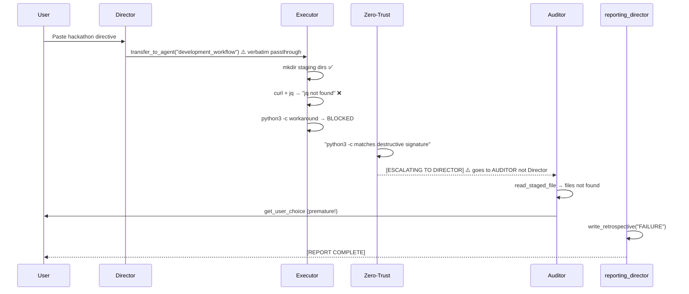

# Walkthrough: Session 317dde31 Post-Mortem

## Session Summary

**Session ID:** `317dde31-72cb-4195-8476-3ef9c6e8775b`
**Objective:** Execute Phase 4 Stages 1-3 of the nf-core Hackathon plan
**Result:** ❌ FAILURE — 4 structural bugs identified

---

## Execution Timeline



---

## Bug #1: Escalation Routing Bypasses the Director

### What happened
The Zero-Trust framework emitted `[ESCALATING TO DIRECTOR]` but control went to the **Auditor**, not the Director.

### Root Cause
The `executor_loop` hit its iteration limit (line 198 of [interceptors.py](file:///Users/harrisonreed/Projects/ngs-variant-validator/agent_app/zero_trust/interceptors.py#L198)). The escalation event has `endOfAgent=True`, which terminates the `executor_loop`. But the graph topology is:

```
autonomous_swarm (SequentialAgent)
  ├── director_loop (LoopAgent)
  │     └── director (LlmAgent)
  │           └── development_workflow (SequentialAgent)   ← Director delegates here
  │                 ├── executor_loop (LoopAgent)          ← ESCALATION happens here
  │                 │     ├── executor
  │                 │     └── qa_engineer
  │                 └── auditor                            ← control falls HERE
  └── reporting_director
```

When `executor_loop` terminates via escalation, the `development_workflow` SequentialAgent simply proceeds to its **next sub-agent: the Auditor**. The escalation signal text goes into the session trace, but structurally, ADK's SequentialAgent doesn't "jump back" to the Director — it moves forward to the next sibling.

### The Fix
The `patched_loop_run` at [interceptors.py:198](file:///Users/harrisonreed/Projects/ngs-variant-validator/agent_app/zero_trust/interceptors.py#L198) needs to propagate the escalation event with `escalate=True` so it bubbles up through the `development_workflow` SequentialAgent AND back to the `director_loop`, where the Director can intercept it and re-task.

Currently the event is yielded but then the function `return`s — the SequentialAgent sees the loop ended normally and moves to the Auditor.

---

## Bug #2: `reporting_director` Name Ambiguity

### What happened
The Auditor bypassed reports (empty staging) and the `reporting_director` wrote a retrospective documenting the failure. The user observed the name `reporting_director` is confusing — it implies it's a Director-level authority.

### Root Cause
Agent name at [agents.py:155-161](file:///Users/harrisonreed/Projects/ngs-variant-validator/agent_app/agents.py#L155-L161):
```python
reporter_agent = LlmAgent(
    model=PRIMARY_PRO_MODEL,
    name='reporting_director',  # ← confusing name
    ...
)
```

### The Fix
Rename to `reporter` or `retrospective_writer`. Update the signal check in [interceptors.py:193](file:///Users/harrisonreed/Projects/ngs-variant-validator/agent_app/zero_trust/interceptors.py#L193) which references `'reporting_director'`.

---

## Bug #3: Director Passes Directive Verbatim (No Synthesis)

### What happened
The Director received the user's full directive and immediately called `transfer_to_agent("development_workflow")` without synthesizing it into an Executor-compatible command. The raw user prompt (with `[@auditor]` tags, stage descriptions, etc.) was passed as-is.

### Evidence from trace
```
**[director] (model)** called tool `transfer_to_agent`:
{
  "agent_name": "development_workflow"
}
```

No intermediate tool calls. No `read_doc`. No `/draft-directive` synthesis. The Director acted as a pure passthrough.

### Root Cause
The Director's [prompt](file:///Users/harrisonreed/Projects/ngs-variant-validator/agent_app/prompts.py#L78-L84) says:
> "You must synthesize complex user objectives into single, comprehensive vertical features."

But it also says:
> "Output ONE directive per turn — no preamble, no prose evaluation, no narrative."

These two instructions conflict. The Director interprets "ONE directive" as "immediately delegate." There's no explicit step requiring it to **read project docs, assess tooling availability, or reformat the directive** for the Executor.

### The Fix
Add explicit pre-delegation steps to the Director's prompt:
1. **Before delegating**, the Director MUST read the directive and identify tooling requirements (e.g., `jq`, `nf-core tools`, GitHub access)
2. **Synthesize a Executor-scoped command** that strips user-facing context and focuses on executable steps
3. **Inject dependency checks** — if the directive implies tools the sandbox may not have, the Director must proactively address this

---

## Bug #4: No Self-Healing for Missing Dependencies

### What happened
The Executor tried `curl + jq` → `jq: not found`. Then tried `python3 -c` → Zero-Trust blocked it as a destructive pattern. Dead end.

### Root Cause
1. The `agentic-self-heal.md` workflow covers Python/Bash script degradation and npm failures, but NOT missing CLI tools in the transient docker sandbox
2. The Executor has no tool to install packages in the sandbox
3. The Director has no mechanism to ask the user "should I install `jq`?" and then retry
4. The `python3 -c` workaround was legitimately blocked by Zero-Trust (it matches the `\bpython3?\s+-c\b` pattern in the DLP firewall)

### The Fix
Two options:

**Option A: Director-level `get_user_choice` for dependency provisioning**
- Add `get_user_choice` to the Director's tool list
- When the Executor escalates with a "missing dependency" signal, the Director:
  1. Presents the user with `["Install jq in sandbox", "Skip this step", "Abort"]`
  2. If approved, installs the dependency and re-tasks the Executor

**Option B: Whitelist the Executor's read-only data tools**
- The Executor doesn't need `jq` — it has `read_workspace_file` and the GitHub MCP tools
- The directive should instruct the Executor to use its native MCP tools (which can read GitHub issues/PRs directly) instead of `curl + jq`
- This is a directive quality problem, not a tooling problem

**Recommendation:** Option B is the correct fix. The Executor already has GitHub MCP access — the directive just didn't make this explicit enough.

---

## Summary of Required Changes

| Bug | File | Change |
|---|---|---|
| **#1: Escalation routing** | [interceptors.py](file:///Users/harrisonreed/Projects/ngs-variant-validator/agent_app/zero_trust/interceptors.py) | Propagate escalation through SequentialAgent to Director |
| **#2: Agent naming** | [agents.py](file:///Users/harrisonreed/Projects/ngs-variant-validator/agent_app/agents.py#L155-L161) | Rename `reporting_director` → `reporter` |
| **#3: Director passthrough** | [prompts.py](file:///Users/harrisonreed/Projects/ngs-variant-validator/agent_app/prompts.py#L78-L84) | Add pre-delegation synthesis requirements |
| **#4: Missing deps** | Directive | Explicitly instruct Executor to use native MCP GitHub tools |

> [!IMPORTANT]
> Bug #1 is the most critical — without fixing escalation routing, the Director can never self-heal because it never receives the escalation signal. All other fixes are secondary.
