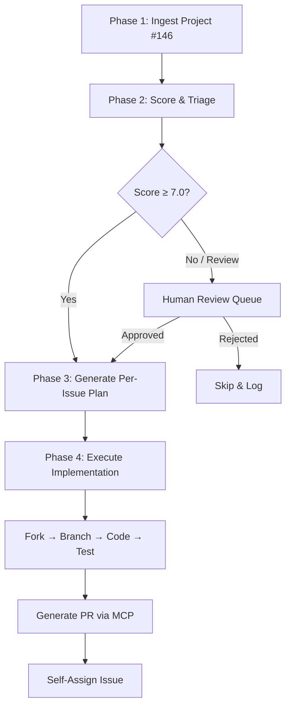

# Nextflow 2026 Hackathon — Autonomous Issue Ingestion & Triage

Prepare the Agentic Swarm to programmatically ingest, triage, plan, and execute contributions against the [nf-core Hackathon March 2026 project board](https://github.com/orgs/nf-core/projects/146).

---

## User Review Required

> [!IMPORTANT]
> **GitHub Token Scope Upgrade Required.** Your current `gh` token has scopes `gist, read:org, repo, workflow`. The GitHub Projects V2 GraphQL API requires the `read:project` scope. You must run:
> ```bash
> gh auth refresh --scopes "read:project"
> ```
> This is non-destructive and additive — it will not revoke existing scopes.

> [!WARNING]
> **nf-core Org Membership.** To self-assign issues and push branches for PRs, you need to be a member of the [nf-core GitHub organization](https://github.com/nf-core). If not already a member, join via [nf-co.re/join](https://nf-co.re/join) and follow the Slack-based onboarding flow.

## Open Questions

1. **Scope of contribution:** Should we target only issues explicitly tagged on Project #146, or also sweep `org:nf-core` for any issue tagged `hackathon` + `good first issue` / `help wanted` across all repos?
2. **PR authorship:** Should PRs be submitted from your personal fork (`HReed1/...`) or do you have push access to nf-core repos directly?
3. **Hackathon coordination:** Should the swarm check Slack channel links embedded in issue descriptions, or is GitHub-only context sufficient?
4. **Parallel execution budget:** How many issues should the swarm attempt in parallel vs. sequential depth-first?

---

## Phase 1: GitHub MCP & Project V2 Ingestion

### 1.1 Tooling Selection

| Tool | Purpose | Status |
|---|---|---|
| `gh` CLI v2.87.0 | GraphQL queries via `gh api graphql` | ✅ Installed at `/opt/homebrew/bin/gh` |
| GitHub MCP Server | REST-based issue search (`search_issues`, `get_file_contents`) | ✅ Connected, authenticated as `HReed1` |
| `jq` | JSON transformation and flattening | ✅ Available via Homebrew |
| Python 3.11+ | Ingestion script for pagination, parsing, deduplication | ✅ Available |

**Strategy:** The GitHub MCP server does **not** expose a native GraphQL tool, and GitHub Projects V2 is **not** queryable via the REST API. Therefore:

- **Primary ingestion path:** `gh api graphql` via shell commands, executing paginated GraphQL queries against the Projects V2 API.
- **Supplementary enrichment:** GitHub MCP `search_issues` tool to sweep for additional hackathon-tagged issues across the entire `nf-core` org that may not be on the project board.
- **Output:** A single `hackathon_issues.json` file persisted locally for offline swarm consumption.

### 1.2 Prerequisite: Token Scope Upgrade

```bash
# HUMAN ACTION REQUIRED — Run this in your terminal
gh auth refresh --scopes "read:project"
```

Verification:
```bash
gh auth status
# Expected: Token scopes now include 'read:project'
```

### 1.3 GraphQL Queries

#### Step 1: Retrieve the Project Node ID

```bash
gh api graphql \
  -f org="nf-core" \
  -F number=146 \
  -f query='
    query($org: String!, $number: Int!) {
      organization(login: $org) {
        projectV2(number: $number) {
          id
          title
          shortDescription
          url
        }
      }
    }
  '
```

This returns the `PVT_kwDO...` node ID needed for all subsequent item queries.

#### Step 2: Retrieve Project Fields (Column Definitions)

```bash
gh api graphql \
  -f id="PVT_kwDO_PROJECT_ID" \
  -f query='
    query($id: ID!) {
      node(id: $id) {
        ... on ProjectV2 {
          fields(first: 30) {
            nodes {
              ... on ProjectV2Field { id name }
              ... on ProjectV2SingleSelectField {
                id
                name
                options { id name }
              }
              ... on ProjectV2IterationField {
                id
                name
              }
            }
          }
        }
      }
    }
  '
```

This maps field names (e.g., "Status" → `Todo`, `In Progress`, `Done`) to their IDs.

#### Step 3: Paginated Item Extraction (Core Query)

```graphql
query($id: ID!, $cursor: String) {
  node(id: $id) {
    ... on ProjectV2 {
      items(first: 100, after: $cursor) {
        totalCount
        pageInfo {
          hasNextPage
          endCursor
        }
        nodes {
          id
          content {
            ... on Issue {
              title
              number
              state
              url
              body
              createdAt
              updatedAt
              author { login }
              assignees(first: 5) { nodes { login } }
              labels(first: 10) { nodes { name color } }
              repository {
                name
                owner { login }
                url
              }
              comments { totalCount }
            }
            ... on PullRequest {
              title
              number
              state
              url
              body
              author { login }
              labels(first: 10) { nodes { name color } }
              repository {
                name
                owner { login }
              }
            }
            ... on DraftIssue {
              title
              body
            }
          }
          fieldValues(first: 20) {
            nodes {
              ... on ProjectV2ItemFieldSingleSelectValue {
                name
                field { ... on ProjectV2SingleSelectField { name } }
              }
              ... on ProjectV2ItemFieldTextValue {
                text
                field { ... on ProjectV2FieldCommon { name } }
              }
              ... on ProjectV2ItemFieldDateValue {
                date
                field { ... on ProjectV2FieldCommon { name } }
              }
              ... on ProjectV2ItemFieldNumberValue {
                number
                field { ... on ProjectV2FieldCommon { name } }
              }
            }
          }
        }
      }
    }
  }
}
```

### 1.4 Ingestion Script

#### [NEW] [ingest_hackathon_issues.py](file:///Users/harrisonreed/Projects/ngs-variant-validator/scripts/hackathon/ingest_hackathon_issues.py)

A Python script that:
1. Calls `gh api graphql` to fetch the Project V2 node ID
2. Fetches all project fields to map status columns
3. Paginates through **all** project items (100 per page)
4. Enriches each item with its field values (Status column, custom fields)
5. **Supplementary sweep:** Calls `gh api` REST search endpoint to find `org:nf-core label:hackathon state:open` issues not on the board
6. Deduplicates by `(repo_owner, repo_name, issue_number)` tuple
7. Writes the final payload to `hackathon_issues.json`

**Output schema for `hackathon_issues.json`:**

```json
{
  "metadata": {
    "project_title": "Hackathon March 2026",
    "project_url": "https://github.com/orgs/nf-core/projects/146",
    "ingested_at": "2026-04-26T13:39:00-04:00",
    "total_items": 87,
    "source": "graphql_projectv2 + rest_search"
  },
  "fields": {
    "Status": ["Todo", "In Progress", "Done", "Backlog"]
  },
  "issues": [
    {
      "id": "PVTI_...",
      "type": "Issue",
      "title": "Add minimap2 module support",
      "number": 1234,
      "state": "OPEN",
      "url": "https://github.com/nf-core/modules/issues/1234",
      "body": "...",
      "author": "maxulysse",
      "assignees": [],
      "labels": ["enhancement", "hackathon", "good first issue"],
      "repo_owner": "nf-core",
      "repo_name": "modules",
      "repo_url": "https://github.com/nf-core/modules",
      "created_at": "2025-12-01T...",
      "updated_at": "2026-03-15T...",
      "comments_count": 3,
      "project_status": "Todo",
      "project_fields": {
        "Priority": "High"
      }
    }
  ]
}
```

#### [NEW] [hackathon_issues.json](file:///Users/harrisonreed/Projects/ngs-variant-validator/scripts/hackathon/hackathon_issues.json)

Generated output file. Gitignored to avoid bloating the repo.

---

## Phase 2: Triage & Selection Protocol

Once `hackathon_issues.json` is ingested, the swarm evaluates each issue using a weighted scoring matrix.

### 2.1 Scoring Matrix

| Dimension | Weight | Criteria | Score Range |
|---|---|---|---|
| **Swarm Capability** | 35% | Can the swarm solve this autonomously? | 0–10 |
| **Label Priority** | 25% | Presence of high-signal labels | 0–10 |
| **Complexity** | 20% | Estimated token-context fit and file count | 0–10 |
| **Freshness** | 10% | How recently updated/created | 0–10 |
| **Assignee Availability** | 10% | Is it unassigned / available to claim? | 0 or 10 |

### 2.2 Swarm Capability Scoring Rules

| Score | Category | Examples |
|---|---|---|
| **9–10** | Python scripting, regex, documentation, config fixes | Fix linting rules, update YAML schemas, docs PRs |
| **7–8** | Groovy/Nextflow DSL2 modules, CI/CD workflow fixes | New nf-test cases, module parameter changes |
| **5–6** | Docker/container changes, template modifications | Dockerfile updates, Singularity recipe fixes |
| **3–4** | Pipeline architecture changes, complex subworkflows | Multi-module refactors, channel routing changes |
| **1–2** | Deep biological domain knowledge required | Novel algorithm implementation, reference genome handling |
| **0** | Manual cluster testing, GUI interaction, hardware access | HPC-specific configs, institutional profile testing |

### 2.3 Label Priority Scoring

| Labels Present | Score |
|---|---|
| `good first issue` + `hackathon` | 10 |
| `hackathon` + `help wanted` | 9 |
| `hackathon` + `documentation` | 8 |
| `hackathon` + `enhancement` | 7 |
| `hackathon` only | 6 |
| `good first issue` only | 5 |
| `bug` + `hackathon` | 7 |
| No hackathon-related labels | 0 |

### 2.4 Complexity Estimation

| Score | Criteria |
|---|---|
| **9–10** | Single file change, <50 lines, clear specification |
| **7–8** | 2–3 files, <200 lines, well-defined scope |
| **5–6** | 4–6 files, moderate refactor, some ambiguity |
| **3–4** | 7+ files, cross-module dependencies |
| **1–2** | Epic-level, needs decomposition into sub-issues |

### 2.5 Selection Threshold

- **Composite Score ≥ 7.0**: Auto-select for implementation planning
- **Composite Score 5.0–6.9**: Flag for human review with recommendation
- **Composite Score < 5.0**: Skip — log reason in triage report

### 2.6 Triage Output

#### [NEW] [hackathon_triage.json](file:///Users/harrisonreed/Projects/ngs-variant-validator/scripts/hackathon/hackathon_triage.json)

```json
{
  "triaged_at": "2026-04-26T...",
  "total_evaluated": 87,
  "auto_selected": 12,
  "flagged_for_review": 8,
  "skipped": 67,
  "selected_issues": [
    {
      "url": "https://github.com/nf-core/modules/issues/1234",
      "title": "Add minimap2 module support",
      "composite_score": 8.4,
      "scores": {
        "swarm_capability": 8,
        "label_priority": 10,
        "complexity": 9,
        "freshness": 7,
        "assignee_availability": 10
      },
      "recommendation": "AUTO_SELECT",
      "rationale": "Documentation/config fix in well-scoped module. Unassigned. Good first issue tag."
    }
  ]
}
```

---

## Phase 3: Implementation Plan Generation

For each issue selected in Phase 2, the swarm generates a standardized Implementation Plan.

### 3.1 Per-Issue Plan Template

Each plan will follow this structure:

```markdown
# Hackathon Issue: [Issue Title]

## Source
- **Issue URL:** https://github.com/nf-core/{repo}/issues/{number}
- **Repository:** nf-core/{repo}
- **Labels:** [list]
- **Triage Score:** X.X / 10.0

## Context Gathering
1. Fork `nf-core/{repo}` to `HReed1/{repo}` (if not already forked)
2. Clone and checkout `dev` branch
3. Read contributing guidelines: `CONTRIBUTING.md`, `.github/PULL_REQUEST_TEMPLATE.md`
4. Identify target files using `grep_search` and `get_file_contents`

## Proposed Changes
### [Component]
#### [MODIFY] [filename](path)
- Description of change
- Diff preview

## Testing Strategy
- **For `nf-core/tools`:** `pytest tests/ -v`
- **For `nf-core/modules`:** `nf-test test modules/nf-core/{module}/tests/`
- **For `nf-core/pipelines`:** `nf-test test tests/`
- **Linting:** `nf-core lint` or `nf-core modules lint {module}`

## PR Generation
- **Branch name:** `hackathon/fix-{issue-number}-{slug}`
- **Commit message format:** `fix(modules): {description} (closes #{issue})`
- **PR template compliance:** Use nf-core PR template fields
- **Target branch:** `dev` (never `master`)
```

### 3.2 Context Gathering Protocol

For each target repository, the swarm will:

1. **`get_file_contents`** — Read `CONTRIBUTING.md` and `.nf-core.yml`
2. **`search_code`** — Find the specific files referenced in the issue body
3. **`list_branches`** — Verify `dev` branch exists as the PR target
4. **`get_file_contents`** — Read `.github/PULL_REQUEST_TEMPLATE.md` for required fields
5. **`issue_read` → `get_comments`** — Read issue discussion for additional context

### 3.3 File Mapping Strategy

| Repository Type | Key File Locations |
|---|---|
| `nf-core/modules` | `modules/nf-core/{tool}/main.nf`, `meta.yml`, `tests/main.nf.test` |
| `nf-core/tools` | `nf_core/{subpackage}/*.py`, `tests/` |
| `nf-core/website` | `src/content/`, `public/`, markdown files |
| `nf-core/{pipeline}` | `main.nf`, `nextflow.config`, `subworkflows/`, `modules/` |

---

## Phase 4: Execution & PR Scheduling

### 4.1 Execution Sequence



### 4.2 PR Generation Protocol

1. **Fork** the target nf-core repo via `fork_repository`
2. **Create branch** via `create_branch` from `dev`
3. **Push changes** via `push_files` or `create_or_update_file`
4. **Create PR** via `create_pull_request` with:
   - Title following conventional commit format
   - Body using nf-core PR template
   - Base branch: `dev`
   - Draft mode: `true` (for human review before finalizing)
5. **Self-assign** the original issue to prevent duplicate work

### 4.3 Rate Limiting & Scheduling

- Maximum **3 PRs per hour** to avoid triggering nf-core CI/CD overload
- Stagger issue self-assignment to respect hackathon etiquette
- Use draft PRs initially; convert to ready-for-review only after local validation passes

---

## Verification Plan

### Automated Tests
1. **Phase 1 verification:** Run `ingest_hackathon_issues.py` → validate `hackathon_issues.json` schema with `jq`
2. **Phase 2 verification:** Run triage scorer → spot-check 5 issues manually against scoring rules
3. **Phase 3 verification:** For each per-issue plan, run the designated test suite (`pytest` or `nf-test`)
4. **Phase 4 verification:** Confirm PR creation via `list_pull_requests` on target repo

### Manual Verification
- Human reviews the triage output to confirm issue selection quality
- Human spot-checks 2–3 generated plans for correctness before execution
- Human reviews draft PRs before converting from draft to ready-for-review

---

## Related Documents

| Document | Description |
|---|---|
| [📂 Issue #5409 Plan](../issues/5409-fix-stub-gz/implementation_plan.md) | Hackathon plan for the stub `.gz` fix |
| [📂 Issue #4570 Plan](../issues/4570-add-stub-blocks/implementation_plan.md) | Plan for adding stubs to remaining modules |
| [📖 nf-core Contributing Reference](../reference/nfcore_contributing_reference.md) | Internalized nf-core conventions |
| [🔙 Nextflow Docs Index](../README.md) | Main documentation index |
