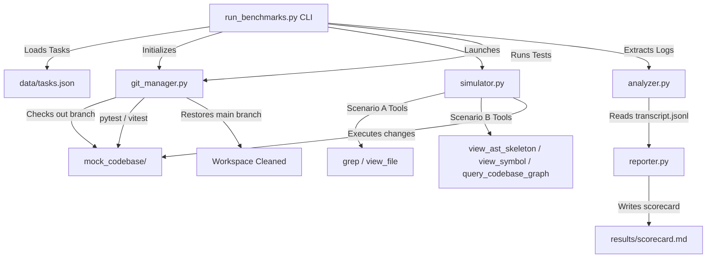

# Context Benchmarking Harness

The **Context Benchmarking Harness** is an automated simulation, testing, and metric-collection platform designed to measure the efficiency, latency, cost, and correctness of **AST-Guided Agent Workflows** (Scenario B) against standard **Text-Based Baseline Workflows** (Scenario A).

It provides empirical proof of how structural context engineering—using abstract syntax tree skeletons, symbol isolation, and code dependency graphs—minimizes LLM context windows while maintaining or improving reasoning correctness.

---

## 📊 Empirical Performance Scorecard

The harness was evaluated across three task tiers (Small, Medium, and Large) in a sandboxed codebase environment. The results demonstrate that limiting LLM views to structural slices dramatically reduces token usage without degrading correctness:

| Metric | Scenario A (Text Baseline) | Scenario B (AST-Guided) | Savings / Reduction | % Change |
| :--- | :---: | :---: | :---: | :---: |
| **Total Input Tokens** | 26,000 | 6,500 | 19,500 | **-75.0%** |
| **Total Output Tokens** | 2,600 | 2,600 | 0 | 0.0% |
| **Total Tokens** | 28,600 | 9,100 | 19,500 | **-68.2%** |
| **Total Tool Calls** | 10 | 10 | 0 | 0.0% |
| **Success Rate (Correctness)** | 3/3 (100.0%) | 3/3 (100.0%) | - | - |

### Key Takeaways
1. **The Input Token Multiplier**: Scenario B achieved a **75.0% reduction in input tokens**. By querying only the AST skeleton of a module and extracting specific class/method blocks, the model avoids reading large files of boilerplate or unrelated code.
2. **Output and Correctness Parity**: Both scenarios achieved a **100% success rate** and identical output token sizes, confirming that structural context isolation does not degrade reasoning capability or lead to incomplete solutions.
3. **Scaling Benefits**: The absolute savings increase with codebase scale. For the small task, it saved 4,500 tokens. For medium and large tasks, it saved 7,500 tokens per run.

---

## 🛠️ System Architecture & How It Works

The harness resides in `context_benchmarking/` and runs evaluations in an isolated, temporary git branch environment.



### Module Breakdown
- **Git & Test Manager (`src/context_benchmarking/git_manager.py`)**: Handles environment isolation. It checks out a temporary git branch for the simulation run, monitors file changes, triggers the test suites (`pytest` and `npm run test`), captures exit codes, and rolls back all workspace modifications to clean up.
- **Dataset Loader (`src/context_benchmarking/dataset.py`)**: Uses Pydantic V2 to load and validate structured task configurations from `data/tasks.json`.
- **Scenario Simulator (`src/context_benchmarking/simulator.py`)**: Coordinates the simulated agent coder loop, passing system instructions and exposing specific toolsets using the `google-genai` SDK.
- **Offline Transcript Analyzer (`src/context_benchmarking/analyzer.py`)**: Parses standard `transcript.jsonl` files from Antigravity agent sessions. It computes the precise token sizes read by the agent and calculates the theoretical savings had the agent used AST skeletons or isolated method/class blocks. It handles method overlap/nesting de-duplication to prevent double-counting.
- **Reporter (`src/context_benchmarking/reporter.py`)**: Aggregates E2E run results, format-checks, and writes the markdown report.

---

## 📁 Repository Directory Structure

```
├── run_benchmarks.py       # Wrapper CLI entry point
├── pyproject.toml          # Python package config & dependencies
├── package.json            # Node workspace config
├── data/
│   └── tasks.json          # Multi-tiered task dataset (Small, Medium, Large)
├── src/
│   └── context_benchmarking/
│       ├── analyzer.py     # Offline transcript analyzer (token calculator)
│       ├── dataset.py      # Dataset loader using Pydantic
│       ├── git_manager.py  # Git branch and test runner manager
│       ├── reporter.py     # Scorecard reporter
│       ├── simulator.py    # Simulated coder agent loop
│       └── tools.py        # Scenario A vs B tool implementations
├── mock_codebase/          # Isolated playground codebase for simulations
│   ├── app/                # Mock app code (FastAPI + ES modules)
│   └── tests/              # Playwright / Vitest & Pytest suites
└── tests/                  # Unit and integration tests for the harness
```

---

## ⚡ Setup & Prerequisites

### Prerequisites
- Python 3.11+ (with `uv` recommended)
- Node.js & npm (for mock frontend tests)
- Git (for workspace isolation checks)

### 1. Python Environment Setup
We recommend using `uv` for python package management:
```bash
# Initialize venv
uv venv
source .venv/bin/activate

# Install package in editable mode with dev dependencies
uv pip install -e .
```

### 2. Node Environment Setup
Install dependencies in the workspace:
```bash
npm install
```

---

## 🚀 Running the Benchmarks

The harness includes a top-level CLI script `run_benchmarks.py` to launch simulated evaluations.

### Run All Benchmarks
To execute all tasks under both Scenario A and Scenario B, run:
```bash
./run_benchmarks.py --task all --scenario both
```

### Run a Specific Task / Scenario
To isolate execution (e.g., running the Medium task under AST-guided Scenario B):
```bash
./run_benchmarks.py --task medium_task --scenario B
```

### CLI Parameters
- `--task`: Task ID to execute (`small_task`, `medium_task`, `large_task`) or `all` (default: `all`).
- `--scenario`: Workflows to execute (`A` for baseline, `B` for AST-guided, or `both`).
- `--model`: Gemini model override (defaults to `gemini-2.5-flash`).
- `--report`: Filepath to write the output markdown report (defaults to `results/scorecard.md`).
- `--clean`: Purges existing `.json`/`.jsonl` files in the results directory before running.
- `--max-steps`: Maximum reasoning loop steps for the coder simulator (default: `15`).

---

## 🔍 Checking and Verifying the Work

The harness is backed by a comprehensive test suite covering all managers, analyzers, and simulators.

### Run Harness Python Tests
To test the python harness components (git isolation, analyzer line-range merging, dataset validation):
```bash
pytest
```

### Run Mock Codebase Tests
To run the mock codebase tests (used by the Git manager during evaluation runs):
```bash
# Python tests (Pytest)
pytest mock_codebase/tests/

# JavaScript client tests (Vitest)
npm --prefix mock_codebase run test
```

---

## ⚙️ How to Adapt to Your Own Uses

### 1. Adding New Tasks to the Dataset
To benchmark your own coding tasks, open `data/tasks.json` and append a new task configuration:
```json
{
  "task_id": "custom_refactor",
  "name": "Custom Component Refactor",
  "size": "medium",
  "difficulty": "medium",
  "description": "Short description of the goal...",
  "branch_name": "task/custom-refactor",
  "files_to_modify": [
    "mock_codebase/app/my_file.py"
  ],
  "test_commands": [
    "pytest mock_codebase/tests/test_my_file.py"
  ],
  "instructions": "Detailed instructions to feed into the coder simulator..."
}
```

### 2. Using the Offline Analyzer on Custom Logs
You can run the `OfflineAnalyzer` independently to analyze standard Antigravity `transcript.jsonl` files from any of your coding sessions. It calculates the input token count consumed by full-file reads and tells you exactly how many tokens you would have saved using AST skeletons.

```python
from context_benchmarking.analyzer import OfflineAnalyzer

analyzer = OfflineAnalyzer(repo_path="path/to/your/repo")
savings_report = analyzer.parse_transcript("path/to/transcript.jsonl")

print(f"Total read events: {len(savings_report.events)}")
print(f"Token Savings: {savings_report.total_savings_tokens} ({savings_report.savings_percentage:.1f}%)")
```

### 3. Hardening and Directory Traversal Guards
All file access tools in the harness (`view_file`, `view_ast_skeleton`, `view_symbol`) implement path containment verification. If you want to use these tools in a production agent:
- They check that target files resolve strictly within the repo root using `os.path.commonpath`.
- They prevent any traversal attacks via relative paths or symbolic link escapes.
